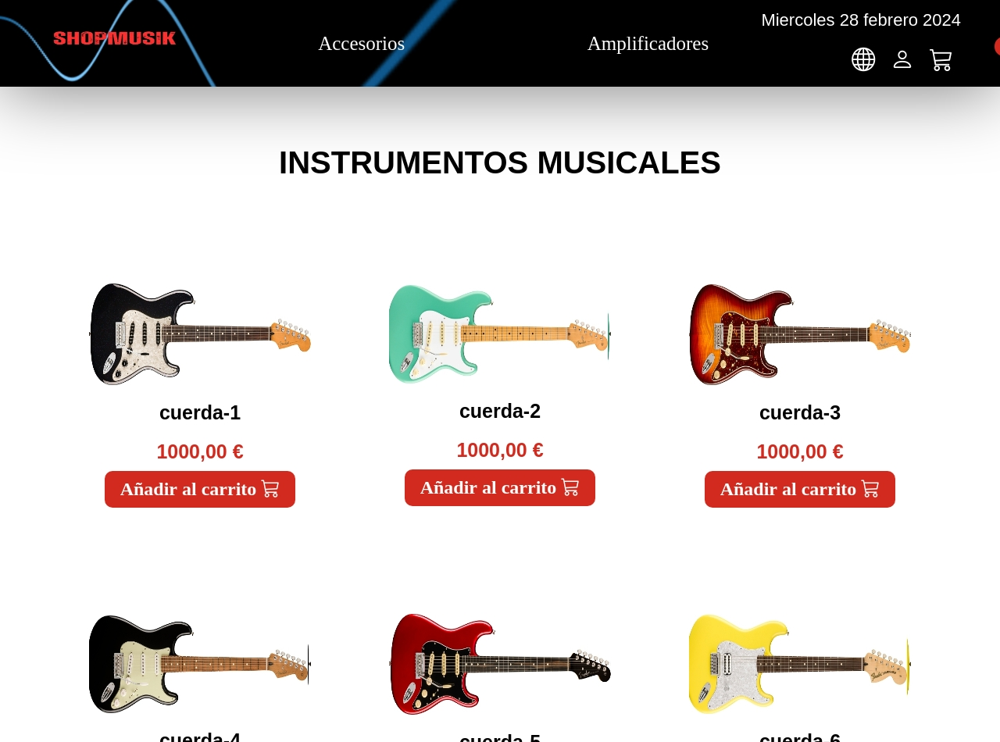
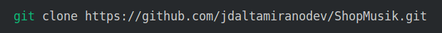

# Sitio Web ShopMusik 

## Puede ver el sitio ShopMusik desplegado en Netlify [ShopMusik](https://shopmusik.netlify.app/)

### Versión Escritorio

 

## Tabla de contenido

1. Información general
2. Estado actual
3. Tecnologías utilizadas
4. Instalación y prueba
5. Marcos de competencia
6. Flujo de Trabajo
7. Versión Tablet
8. Versión Móvil

## Información general

Web estatica Modelo E-commerce. Consta de:

* Inicio: Página donde se muestran los diferentes instrumentos.
* Menu de navegación: Catalogo, Accesorios, Amplificadores.
* Catalogo: Página donde se muestran los productos del catalogo quee incluye imagen del producto, nombre, y precio.

## Estado actual

Finalizado.

## Tecnologías utilizadas

* HTML5
* CSS3
* Javascript
* Modernizr
* Linux
* Terminal
* Git
* GitHub
* GitKraken
* Netlify
* Visual Studio Code
* Trello

## Instalación y prueba

1. Copia la URL del proyecto
   
```
https://github.com/jdaltamiranodev/ShopMusik.git
```

2. Abra una terminal, selecione la carpeta donde desea clonar el proyecto, después use el comando git clone y pegue la URL al final dejando un espacio.
3. Finalmente pulse enter. (Tenga en cuenta que debe tener instalado git)

 

```
$ git clone https://github.com/jdaltamiranodev/ShopMusik.git
```
* Opcional: Puede copiar y pegar la linea anterior en su terminal en la carpeta elegida para clonar el proyecto.

4. Navegue hasta la carpeta clonada, abra el archivo index.html. Presione el botón derecho del ratón y elija la opción "Abrir en navegador predeterminado". Se abrira el navegador en la pagina principal del proyecto y podrá navegar por el mismo.
   
## Marcos de competencia

* HTML5
* CSS3
* Flex Box
* CSS Grid
* Javascript
* Normalize
* Modernizr
* Responsive Design
* Responsively
* Linux
* Terminal 
* Chrome
* Firefox
* Safari
* Git
* GitHub
* GitKraken
* Netlify
* Visual Studio Code
* Trello

## Flujo de Trabajo

 

## Versión Tablet

 

## Versión Móvil

 


# Integrantes

* **Jhon Davila**
* **Jonathan Domínguez**
* **David Altamirano**
* **Kelthoum DJ**
* **Ana Iashvili**
